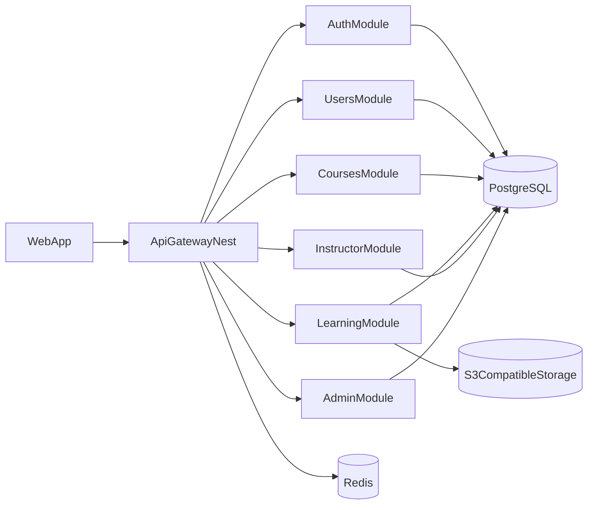

# Backend v1 Architecture - Web MVP

## 1) Purpose

Define a minimal, production-ready backend architecture for Learn.Aibot.KZ web MVP with clear growth path to mobile clients.

## 2) Technology Choices

- **Runtime/Framework:** Node.js 20 + NestJS
- **Language:** TypeScript
- **Database:** PostgreSQL + Prisma ORM
- **Cache/Rate limit support:** Redis
- **Storage:** S3-compatible object storage for lesson assets
- **API style:** REST (`/api/v1`)

## 3) Architecture Principles

- API-first and versioned contracts.
- Modular monolith for MVP (faster delivery, lower ops overhead).
- RBAC at route/service boundaries.
- Idempotent progress updates.
- Clear separation of write and read responsibilities inside services.

## 4) High-level Components

## 5) Domain Model (MVP Minimum)

- `users`: identity, profile, role.
- `courses`: metadata, publication status, ownership.
- `modules`: ordered groups within course.
- `lessons`: ordered learning units (`VIDEO`, `TEXT`, `QUIZ`).
- `enrollments`: link user to course and aggregate progress.
- `progress`: user progress per lesson.

## 6) Module Responsibilities

- **AuthModule:** register/login/refresh/logout, password hashing, JWT management.
- **CoursesModule:** public catalog and course detail read models.
- **LearningModule:** enrollment and progress operations.
- **InstructorModule:** course/module/lesson authoring and publish workflow.
- **AdminModule:** moderation and role governance.

## 7) Security Model

- Access token + refresh token flow.
- Role-based guards:
  - `STUDENT`: learner endpoints.
  - `INSTRUCTOR`: content authoring for owned courses.
  - `ADMIN`: moderation and role updates.
- Input validation with DTO schemas on all write endpoints.

## 8) Data Consistency Rules

- Unique constraints for ordering:
  - `modules (courseId, order)`
  - `lessons (moduleId, order)`
- One enrollment per user/course: `enrollments (userId, courseId) UNIQUE`.
- One progress row per user/lesson: `progress (userId, lessonId) UNIQUE`.
- Progress updates are upserts to avoid duplicate state.

## 9) Observability Baseline

- Structured JSON logs with request id.
- Metrics:
  - request count by endpoint/status;
  - P95 latency for read endpoints;
  - error rate for write endpoints.
- Audit logs for publish/unpublish and role changes.

## 10) Evolution Path (Post-MVP)

- Add payment module and subscription state machine.
- Add background jobs (transcoding, notifications, certificates).
- Harden API for mobile clients (token/session policy adjustments).
- Optionally split hot modules into services when scale justifies it.
