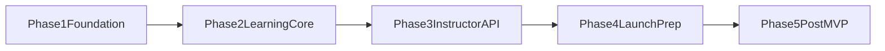

# Implementation Plan - Web MVP Backend-first

## Planning Horizon

- **Duration:** 10 weeks (MVP)
- **Method:** backend-first delivery, API contracts before UI integration
- **Team baseline assumption:** 2 backend + 1 frontend + 1 QA (shared)

## Phase Roadmap

## Phase 1 - Foundation (Week 1-2)

**Goals**
- Create backend skeleton and engineering baseline.

**Deliverables**
- NestJS project structure with modules: auth, users, courses, learning, instructor, admin.
- Prisma schema + initial migrations.
- Local docker compose for PostgreSQL and Redis.
- Auth endpoints (`register`, `login`, `refresh`, `logout`).
- RBAC guard foundation.
- CI checks: lint, tests, build.

**Dependencies**
- None.

**Exit criteria**
- Auth flow works end-to-end with test coverage for happy path and auth failures.

## Phase 2 - Learning Core (Week 3-4)

**Goals**
- Deliver student core learning flow.

**Deliverables**
- Course catalog and course detail APIs.
- Enrollment endpoint and enrollment list.
- Lesson fetch endpoint with access checks.
- Progress upsert endpoint and user progress summary.
- Pagination/filtering standards for list endpoints.

**Dependencies**
- Requires Phase 1 auth/RBAC and migrations.

**Exit criteria**
- Student can sign in, enroll, open lessons, and persist progress via API only.

## Phase 3 - Instructor Console API (Week 5-6)

**Goals**
- Deliver content authoring and publication flow.

**Deliverables**
- Instructor CRUD for courses/modules/lessons.
- Ordering APIs for modules and lessons.
- Draft/publish/unpublish endpoints.
- Ownership checks: instructors can mutate only owned courses.
- Basic admin moderation endpoints.

**Dependencies**
- Requires Phase 2 course/lesson model stabilization.

**Exit criteria**
- Instructor publishes a complete pilot course without direct DB changes.

## Phase 4 - Quality and Launch Prep (Week 7-8)

**Goals**
- Stabilize and prepare MVP for staging launch.

**Deliverables**
- Integration tests for critical flows (auth, enrollment, progress, publish).
- Structured logging and baseline dashboards.
- Error handling standardization and API error contract.
- Staging deployment and smoke test checklist.

**Dependencies**
- Requires all prior phases functionally complete.

**Exit criteria**
- Staging smoke tests pass with acceptable API latency and error rate.

## Phase 5 - Post-MVP Extension (Week 9-10+)

**Goals**
- Prepare next wave of capabilities without blocking MVP release.

**Deliverables**
- Payment module design and webhook strategy.
- Video pipeline design (queue + transcoding workers).
- Mobile-readiness backlog (token lifecycle, offline sync boundaries).

**Dependencies**
- Requires MVP baseline in production-like operation.

## Dependency Graph

## Epic to Feature Mapping

- **Epic A: Identity and Security**
  - registration/login/refresh/logout
  - JWT + RBAC guards
- **Epic B: Learning Experience Core**
  - catalog/details
  - enrollment
  - lesson access and progress
- **Epic C: Content Operations**
  - instructor CRUD
  - publish workflow
  - admin moderation
- **Epic D: Reliability and Release**
  - tests, logs, metrics
  - staging + smoke process

## Launch Readiness Checklist

- API contract frozen for `/api/v1` MVP endpoints.
- Core critical-path tests green in CI.
- Rollback strategy documented for staging/production deployment.
- Incident contacts and alert thresholds defined.
